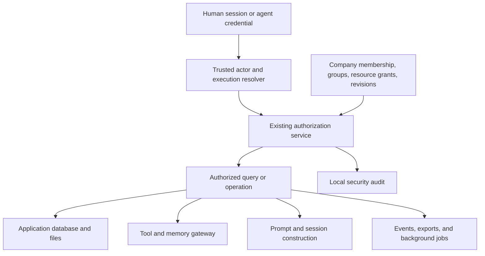

# Self-Hosted Agent and User Permissions

Date: 2026-10-05

Status: Implementation started; P1a policy constraint implemented, protected-resource activation pending

Scope: The self-hosted Paperclip application

Delivery sequence: Plan -> Spec -> Build -> Test -> Review -> Pull request

## 1. Outcome

Paperclip will enforce resource access for human users and agents across its backend, APIs, tools, search, conversations, files, and execution context. A person or agent must not obtain access merely by belonging to the same company, knowing an object ID, controlling a prompt, or calling a different API route.

The first complete release will support restricted projects within a company. Its acceptance example is:

- Acme has an HR group, an Engineering group, and a restricted HR project named "2027 Layoffs".
- Alice and the dedicated HR agent have explicit project grants. Bob is an Engineering user. Carol belongs to HR but has no grant to this project.
- Alice can use the HR agent only within the intersection of her access, the agent's access, and the current execution grant.
- Bob and Carol cannot discover the project, its title, tasks, conversations, documents, attachments, outputs, or activity through any Paperclip surface.
- Company administration alone does not grant access to this project's content.
- Removing a grant blocks new access and invalidates affected execution, delivery, and session reuse.

This document contains the requirements, design, implementation plan, test plan, and review criteria in one file. It does not claim that these protections already exist.

## 2. Scope and explicit boundaries

### In scope

- Existing self-hosted deployments using authenticated human sessions and agent credentials.
- Multiple companies on one instance, with `company_id` remaining the tenant boundary.
- Company roles, company-local groups, project access, agent access, and protected task/conversation content.
- Server-side authorization for reads, mutations, enumeration, execution, tool use, and delegation.
- Existing search, attachments, artifacts, documents, live events, notifications, exports, and background work.
- Existing memory connectors and prompt construction; contracts for future knowledge/RAG features.
- Migration from the current company-wide visibility model without silently exposing newly restricted work.
- A basic self-hosted permissions UI and CLI/API parity.

### Out of scope for this implementation

- AWS IAM/STS, Azure RBAC, GCP IAM, Kubernetes deployment authorization, or cloud credential brokerage.
- Managed SaaS provisioning, subscriptions, billing, and platform tenancy orchestration.
- Replacing Better Auth, requiring an external identity provider, or implementing enterprise SSO/SCIM.
- A required OpenFGA service or a second policy engine.
- Building a new vector database, knowledge product, or general memory store.
- Nested groups, arbitrary user-authored policy code, and a general-purpose deny-rule language.
- Claims of protection from the machine administrator, database owner, trusted in-process plugins, or a compromised control-plane process.

The design leaves room for future cloud delegation and relationship engines, but this release must work without them. Existing provider authentication and connector behavior remain relevant only where they already serve the self-hosted app.

### Two distinct guarantees

**Application isolation:** all supported Paperclip entry points enforce the same resource policy. This requires `authenticated` mode for human isolation.

**Agent execution containment:** an agent cannot bypass that policy by reading the host filesystem, reusing another session, accessing a broad credential, or contacting a provider directly. Protected execution is enabled only on a runtime that passes the containment checks in section 11. An application ACL alone cannot provide this guarantee.

Throughout this document, **protected** means any content whose audience is narrower than the company baseline, including members-only projects, restricted projects, private conversations, and private agent/document scopes. Containment, provenance, revocation, and release gates apply to all of them, regardless of classification label. Restricted projects are the acceptance example, not the only protected resource.

`local_trusted` deliberately creates an implicit full-control board identity. It remains a single-operator convenience mode, with an explicit UI description that it provides no isolation between human users. A company with scoped-mode protected content cannot be served in this mode: startup and configuration changes must reject that combination. File/DB administrators can still bypass application controls outside Paperclip.

## 3. Current implementation and proposed changes

The following baseline was inspected on 2026-10-05. Source paths describe existing components, not proof that all intended enforcement is complete.

| Current component | Current behavior or purpose | Required change |
|---|---|---|
| `server/src/middleware/auth.ts` | Resolves session, board, agent-key, and agent-JWT actors; local trusted mode has an implicit board | Preserve identity resolution; require authenticated mode for protected human access |
| `server/src/services/authorization.ts` | Central action/resource decisions, scoped credentials, responsible-user checks, role defaults, and low-trust boundaries | Extend this service with resource scopes and a reusable authorized-query contract |
| `server/src/agent-auth-jwt.ts` | Run JWTs currently default to 48 hours; legacy claim/signature compatibility exists | Add renewal and a strict credential profile before enabling shorter protected-run lifetimes |
| `server/src/services/company-member-roles.ts` | Human roles include owner, admin, operator, and viewer | Preserve names and separate administrative powers from restricted content grants |
| `packages/db/src/schema/principal_permission_grants.ts` | Company/principal/action grants with JSON scope; one row per company/principal/action | Keep compatibility grants; add typed resource grants without abusing the existing uniqueness constraint |
| Project/agent membership tables | Joined/left and related personal navigation state | Keep as preferences; never reinterpret them as access grants |
| `server/src/routes/projects.ts` | Company-scoped lists with per-resource checks | Push authorization into queries, counts, pagination, and direct-object handling |
| `server/src/services/company-search.ts` | Company-scoped search; callers enforce company access | Pass trusted authorized scope into search, extraction, snippets, and counts |
| `server/src/realtime/live-events-ws.ts` | Company subscription authorization and company event delivery | Reauthorize resource delivery and invalidate subscriptions after revocation |
| `server/src/services/tool-access-policy.ts` and `tool-gateway.ts` | Existing grants, profiles, responsible-user checks, and approval mechanisms | Add resource constraints and execution scope to these existing gates |
| Persistent Agent Chat | Conversation state is stored on issues/comments, with provider state in agent task sessions | Protect the actual issue/comment/session paths; do not introduce a parallel chat store |
| Memory connections | Experimental external providers, including Cognee | Require enforceable dataset/session/resource scope for protected work |
| Local runtime sandbox support | Linux process sandbox support exists; capabilities vary by runtime | Qualify capability explicitly; fail closed for unsupported protected execution |

### Compatibility with repository contracts

The current [V1 implementation contract](../SPEC-implementation.md) sections 3 and 9.4-9.5 describe company-wide work visibility and defer project/issue privacy. [The product definition](../PRODUCT.md) also requires ordinary company skill work to remain open unless an explicit restriction exists. This proposal intentionally changes the former for a new scoped mode; it preserves the latter through an explicit compatibility policy.

Do not relabel sidebar join/leave, private-network exposure, or low-trust agent presets as project privacy. They serve different purposes.

When implementation begins, update `doc/SPEC.md`, `doc/SPEC-implementation.md`, `doc/PRODUCT.md`, `doc/DATABASE.md`, and `ROADMAP.md` additively as the corresponding behavior lands. `doc/TASKS.md` is currently a task-model document, not this feature's status tracker. Keep the feature's reviewable work and validated status in this document until the repository adopts another tracker. This spec-only change does not rewrite existing contracts or mark roadmap functionality shipped.

## 4. Architecture decision

Extend the existing TypeScript authorization service and PostgreSQL storage. Keep policy state, resource ownership, revision changes, and audit records in one transactional database. Do not add a new dependency for the first release.

OpenFGA remains a future backend option behind the same application contract. This choice reduces deployment and relationship synchronization work for self-hosted users. OpenFGA's adoption guidance also recommends resource-oriented checks and describes synchronization tradeoffs. [OpenFGA adoption patterns](https://openfga.dev/docs/best-practices/adoption-patterns).



Authentication establishes identity. Authorization decides the current action on the current resource. Execution context narrows the authority available to a particular run. Approval, budget, checkout, and runtime controls are additional required checks; none substitutes for authorization.

### Required service contract

Extend existing types rather than create a competing evaluator. The names below are proposed interfaces, not existing APIs:

```ts
authorize(actor, action, resourceRef, executionContext?): Decision
requireAuthorized(actor, action, resourceRef, executionContext?): AuthorizedResource
authorizedQueryScope(actor, action, resourceType, companyId, executionContext?): QueryScope
explainAuthorization(requester, subject, action, resourceRef): RedactedExplanation
```

- Resource references identify a record; the server resolves its company and scope from storage.
- Clients cannot assert their own company, project ancestry, grants, classification, or responsible user.
- `QueryScope` is a server-internal typed predicate, not client-supplied SQL, an unbounded ID list, or a reusable bearer capability.
- Decisions include allow/deny, a stable reason code, policy revision, and decision ID. Client explanations disclose only resources and grant details the requester may inspect.
- Unknown actions, scope types, unsupported conditions, missing scope, and malformed policy fail closed.
- Authorization failure and dependency failure are distinct. Missing authentication returns 401; hidden or nonexistent resources return the same 404; denied actions on visible resources return 403. An unavailable policy/database dependency returns a redacted service error, never an allow fallback.

## 5. Principals, scopes, and inheritance

### Principals

- **User:** existing authenticated user with current company membership.
- **Agent:** existing company-owned agent, independently granted access.
- **Group:** company-local membership set for users and agents. Initial groups are flat; membership cannot cross companies.
- **Automation delegation:** durable, explicitly scoped authority for a routine or other noninteractive job. Its grantor, owner, target agent, and validity are recorded. It does not manufacture a human session.

Department names such as HR and Engineering can be represented by groups for this release. The agent reporting tree is not a data-access hierarchy. Becoming a manager, CEO, assignee, reviewer, or mentioned participant does not automatically open restricted content.

### Authorization scopes

Use an authorization scope distinct from an execution workspace. An execution workspace is a runtime/filesystem resource, not an organizational department or an implicit access grant.

The first scope types are company, project, agent configuration, standalone document, and private conversation. Every sensitive record resolves to exactly one authoritative scope through a typed ownership path. Issue comments, document revisions, attachments, and work products inherit their containing issue's scope. A projectless ordinary issue belongs to the company scope. A private conversation is an issue-backed scope with explicit participants. An agent's configuration scope controls that agent as an object; its grants on other scopes control the agent as a principal. Neither implies the other.

Each scope records its company, owner resource, classification, access mode, and policy revision. Resource containment and permission inheritance are separate fields/rules. Ordinary project child issues inherit the project scope even when task parentage points elsewhere. Cross-scope links never grant access to their targets.

Supported access modes:

| Mode | Read grant source | Intended use |
|---|---|---|
| `company` | Explicit company baseline plus applicable resource grants | Existing shared work |
| `members` | Explicit user, agent, or group grants on the scope | A department or project team |
| `restricted` | Explicit user/agent grants and explicitly selected groups on the scope; no company/parent inheritance | Sensitive work |

An HR group can be explicitly granted access to a members-only project. It is not automatically granted access to every HR-owned project. If a group is explicitly added to a restricted project, every current group member receives the specified rights; the UI must show that consequence.

Binding a group to a protected scope must atomically validate or narrow that group's administration. Membership additions and manager changes require grant-management authority over every protected scope they affect; removing members may use separately delegated revocation-only authority. Existing company/group managers cannot retain an indirect ability to add protected readers without those rights. Lock/version both the binding and group membership so simultaneous binding and membership changes cannot bypass the check. Use separate groups when their managers should have different security boundaries.

Classification is `normal`, `internal`, `confidential`, or `restricted`. It supports handling and audit rules, not authorization by itself. Classification `restricted` requires access mode `restricted`; invalid combinations are rejected. A nonrestricted classification may still use a narrower access mode.

Missing ACL data never means public or company-readable in scoped mode. Broad company access is a named policy, not an implicit fallback.

### Inheritance and publication rules

1. Company isolation is unconditional. No resource grant, group, role, or run crosses it.
2. A restricted scope excludes all company/parent content inheritance, including owner/admin role shortcuts.
3. Child content inherits its authoritative scope. The first release does not add arbitrary exceptions for individual comments or revisions.
4. Standalone documents and agent configuration require their own explicit scope binding; multi-parent objects cannot use an "any readable parent" rule to expose restricted content.
5. Moving, copying, linking with an excerpt, exporting, or republishing content into a broader scope requires source read and explicit publication authority, plus target write. A target ACL alone is insufficient.
6. Mixed-scope generated output remains accessible only to an audience permitted by every source scope. It must stay in a compatible restricted destination or use an explicit reviewed release operation. That release operation may be deferred; automatic downgrade is always denied.
7. Marking a project restricted blocks new broad access immediately. It cannot revoke material already downloaded, copied, or seen by a model. Migration must identify persisted derivatives and sessions before declaring the project isolated.

For agent-generated content, the server maintains a monotonically accumulating source-scope set on the execution and provider session. Initialize it from every exposed mount, restored session, and input, then extend it before returning further protected retrieval results. Bind every comment, log, tool publication, attachment, summary, and memory write to that set, even if the submitted content has no citation or source reference. The model cannot declare its own output harmless. A conservative first release confines all outputs to a compatible audience and denies broader publication.

Persist source dependencies on derived content and enforce all of them on later reads. Destination membership or ACL widening must not expose an earlier derivative to someone lacking source access. Source removal/deletion fails closed until an explicit authorized release or retention action resolves the dependency. Imported or historical sessions without trustworthy provenance are quarantined or restarted. This is an application-controlled data-flow rule, not a promise to prevent an authorized human from copying information outside Paperclip.

This avoids the unconditional `viewer from parent` rule in the original concept, which would expose restricted child projects. OpenFGA similarly grants inheritance only through modeled relationships. [Parent-child relationships](https://openfga.dev/docs/modeling/parent-child).

## 6. Permission vocabulary and roles

Retain the repository's `resource:action` convention. Do not introduce dot-separated duplicates or rename current keys wholesale. Consolidate existing `AuthorizationAction` values and grantable `PermissionKey` values through a reviewed mapping; every new action has defined resource types, UI meaning, and enforcement sites.

The following is the proposed capability set, grouped for implementation. Existing action names can remain canonical where equivalent:

| Resource | Actions to represent |
|---|---|
| Company | Read metadata, manage settings, manage users/groups, inspect security audit |
| Project | Read, create, update, archive/delete, manage access, change classification |
| Issue/task | Read, create, comment, update, assign, export; preserve checkout controls |
| Agent | Read profile, execute/wake, configure, change instructions, manage grants, retire |
| Conversation | Read, create, write, delete, export, manage participants; map to issue-backed storage |
| Document/artifact/file | Read, create/upload, update, delete, download/export |
| Runtime/workspace | Use, inspect logs/files, manage services, execute commands |
| Tool/connection | Discover, execute, manage connection, manage profiles, approve invocation |
| Secret | Inspect metadata, use for an operation, reveal value, configure binding |
| Memory/knowledge | Read/search, write/ingest, delete; provider scope required |
| Authorization | Inspect own access, inspect/manage scoped grants, revoke execution, publish across scopes |

Permission to execute an agent does not imply permission to edit its instructions, change its runtime, or retrieve its credentials. Permission to configure a credential-bearing agent is itself sensitive: it can redirect code and cause data exfiltration. Configuration changes must therefore respect the agent's maximum authority and require the appropriate scope manager.

### Human-facing roles

Keep existing company roles: owner, admin, operator, viewer. Add project role presets: access manager, contributor, reader. Presets expand into explicit actions; role names are not universal bypasses.

| Role/capability | Shared company work | Restricted project content | Restricted project access changes |
|---|---|---|---|
| Company owner/admin | Existing compatible defaults | Requires explicit content grant | No implicit project grant-management authority |
| Company operator/viewer | Existing role limits | Requires explicit content grant | None unless explicitly delegated |
| Project reader | Granted project only | Read if explicitly granted | None |
| Project contributor | Granted project only | Scoped read/write if explicitly granted | None |
| Project access manager | As separately granted | Content access is separately stated in the preset | May administer bounded grants for that project |
| Instance administrator | Infrastructure lifecycle and recovery | No normal API read bypass in scoped mode | Explicit recovery process only |

Project creation gives the creator an explicit access-manager grant and explicitly selected content permissions in the same transaction. Removing the last access manager is rejected unless a valid recovery owner is recorded.

Administrative separation must also cover indirect escalation. Company role editors cannot appoint themselves project access managers, add themselves to a protected group, mint another principal's credential, impersonate a reader, or reconfigure a powerful agent as a route to restricted data. Protected groups and agent credentials inherit the relevant administrative constraints. Authentication recovery and host/DB access remain privileged operational boundaries.

Ordinary in-app administrative rights also cannot download a whole-instance backup, restore a readable clone, reveal raw secrets, install arbitrary control-plane code, or change the authorization backend. Those capabilities are equivalent to data-access or host authority and belong to the explicit trusted operator boundary. A UI role described as infrastructure-only must not quietly include them.

The first release has no silent break-glass API. Lost-access recovery is an explicit offline operator procedure with a reason and durable audit record, followed by invalidation of affected credentials/sessions. A time-limited, approved in-app break-glass workflow is deferred. Do not claim an audit trail can prevent a machine owner from altering the database.

### Skill compatibility

Preserve normal company skill operations through a named baseline policy for active company agents, subject to existing explicit restrictions, secret handling, path containment, and validation. Do not require a new per-skill grant for every existing installation.

A shared company skill is not a safe destination for restricted project data. Restricted execution must not publish its retrieved material into company-visible skills, agent instructions, or global memory. Importing/testing a skill also cannot broaden the caller's filesystem, tool, or execution grant. Existing configured restrictions remain enforced independently of which administrative UI is installed.

## 7. Authorization evaluation

### Human request

An allow decision requires all of:

1. Valid identity and active company membership.
2. Resource resolution within that same company.
3. A current applicable action grant from direct access, a group, or permitted inheritance.
4. No disabled identity, revoked grant, restricted-boundary violation, or other hard policy restriction.
5. Any existing approval, checkout, budget, or lifecycle requirement for the operation.

An allow cannot override a company boundary, execution limit, existing explicit restriction, or approval requirement. Initial resource ACLs are positive grants plus disabled inheritance; a generic deny-rule language is unnecessary.

### Agent request

```text
Effective authority =
    current agent authority
  INTERSECT current initiating-user authority OR explicit automation delegation
  INTERSECT execution/task grant
  INTERSECT resource policy
  INTERSECT credential scope and runtime/tool restrictions
```

The user-versus-automation branch is selected by trusted execution provenance, never by a request parameter. For an interactive run, an unavailable or removed responsible user is a denial, not a reason to fall back to agent-only permission.

Scheduled work requires an explicit durable delegation that identifies its sponsor and owner, allowed agent, scope, actions, expiry/review policy, and lifecycle. Losing the sponsor's authority suspends it until an authorized owner explicitly reauthorizes it. A schedule cannot convert a formerly human-directed run into privileged system work.

Delegation to another agent cannot increase authority. Child runs inherit a subset of their parent's grant and additionally intersect the recipient agent's current authority. Revoking the parent invalidates descendants. A task assignment, mention, or known task ID never mints a grant by itself.

## 8. Execution grants and revocation

Reuse heartbeat run IDs, issue IDs, responsible-user attribution, existing scoped-key support, and native-run authority. Add a server-side execution grant, rather than placing the complete policy in a JWT.

Example proposed persisted context:

```json
{
  "executionId": "run_example",
  "companyId": "company_acme",
  "agentId": "agent_hr",
  "responsibleUserId": "user_alice",
  "automationDelegationId": null,
  "issueId": "issue_headcount",
  "scopeIds": ["scope_layoffs"],
  "actions": ["issue:read", "issue:comment", "document:read"],
  "parentGrantId": null,
  "policyRevision": 42,
  "expiresAt": "2026-10-05T22:15:00Z",
  "revokedAt": null
}
```

These are illustrative identifiers, not credentials. The runtime credential carries a signed issuer, audience, subject, company, run/grant reference, token ID, issue time, and expiry. Validate algorithm, signature, audience, issuer, lifetime, current principal state, run binding, and the server-side grant. A request header containing a run ID provides attribution only unless matched to verified credential/run state.

Proposed default: execution credentials expire after 15 minutes and renew only through the trusted runtime controller after fresh authorization. Long-lived agent API keys remain supported for compatible integrations but do not directly authorize protected execution; they must exchange for a bounded run grant. Already task-scoped credentials retain their stricter restrictions.

This is a lifecycle change: current run JWTs default to 48 hours and are minted at spawn. Implement controller-mediated renewal, token rotation, resume after host sleep, restart recovery, and expired-token failure handling before reducing their lifetime. Protected execution requires mandatory issuer/audience/instance claims and the new grant binding; legacy signature or missing-claim compatibility must not admit a protected request. Current cancellation checks do not universally revoke JWT reads; the new path must gate reads and writes. Reuse `run_identity_contexts` for immutable attribution while keeping revocable authority in execution grants.

On user/agent removal, grant removal, protected-group membership change, scope move, approval withdrawal, or run cancellation:

- Commit the policy revision and revocation state atomically.
- Reject newly admitted operations against old grants; expiry is not the only revocation mechanism.
- Invalidate authorization/query caches and delivery subscriptions by company, principal, scope, and revision.
- Stop or fence affected runs and provider-session reuse. A failed process stop does not authorize continued API, credential, or publication access.
- Reauthorize renewal, queued jobs, pending tool calls, exports, and callbacks.
- Record the change and affected execution references in audit without copying private content.

Define the concurrency boundary precisely: an operation admitted before revocation may already have produced an external effect. New admissions after the revocation transaction commits must be denied. Mutating DB operations lock/revalidate the relevant policy revision in the same transaction; remote operations use short authorization leases and recheck before dispatch and publication. Do not promise to reverse an already completed tool action or erase information already sent to a model.

For the first implementation, avoid cross-request positive authorization caches for protected work. Later caching requires revision checks against current authority, not a TTL-only stale allow. Streaming delivery rechecks before each protected delivery batch and stops on revocation; bytes already delivered cannot be recalled.

## 9. Data model and consistency

Proposed additive tables/records, with final names settled during schema review:

| Record | Required fields and constraints |
|---|---|
| `authorization_scopes` | Company, typed owner, parent/containment reference, access mode, classification, revision; one scope per owner |
| `authorization_groups` | Company, name, bounded group-administration policy, revision |
| `authorization_group_members` | Company, group, user/agent principal; unique membership; company consistency |
| `resource_permission_grants` | Company, scope, principal type/id, action or versioned role preset, grantor, expiry/revocation, revision; uniqueness includes scope |
| `execution_grants` | Company, run, agent, responsible user or automation delegation, allowed scopes/actions, parent grant, timestamps, revocation |
| `automation_delegations` | Company, sponsor/owner, routine or service binding, agent, scopes/actions, lifecycle and review/expiry |
| Source-scope dependency records | Company, run/session or derived resource, source scope/revision; server-written, monotonic during execution, validated on subsequent reads/publication |
| `authorization_events` | Append-oriented security decision/mutation evidence; no prompts, tokens, or file contents |

Prefer typed foreign keys and composite company/resource constraints. Where a polymorphic principal cannot use a single foreign key, use type-specific references with checks or transactionally validated references; do not accept arbitrary principal strings without validation. Scope ancestry must be acyclic and company-local.

Resource-to-scope resolution may use existing parent foreign keys for simple child objects. Indexed scope references are required where they support efficient search/list predicates. Any denormalized scope must be server-maintained and updated transactionally with reparenting; clients cannot edit it independently.

Resource creation, initial grants, revision change, and mutation audit commit together. A newly created restricted resource must never become briefly company-readable. Grant updates use compare-and-swap/version checks so concurrent editors cannot silently overwrite each other.

Retain existing company-level permission grants and scoped credential contracts. A compatibility resolver maps them into the new decision path; it does not union legacy broad access into a restricted scope. The existing scope parser tolerates unknown metadata as unconstrained compatibility input; new authorization scopes require a separate strict, versioned validator and must never inherit that fallback. Unsupported legacy scope expressions block activation until migrated or explicitly resolved.

Deletion/recreation must not resurrect grants. Use stable IDs and revoke dependent grants; imports allocate new IDs and remap references. Copies and restores carry access metadata, remain quarantined until validated, and never acquire broad access because a grant target is missing.

### Database isolation

All tenant-owned records use Paperclip's existing `company_id`; do not add a competing `tenant_id`. Scope-aware SQL uses company predicates plus authorized-scope predicates before content hydration, counts, ranking, and pagination.

PostgreSQL RLS is optional defense in depth after the application evaluator is correct. If introduced, use transaction-local context, tested connection-pool reset behavior, separate migration/runtime roles, and tests for table-owner/BYPASSRLS behavior. RLS does not replace resource authorization or protect against a database superuser. [PostgreSQL row security](https://www.postgresql.org/docs/current/ddl-rowsecurity.html).

The repository instructions mention PGlite, while current development/database documentation describes embedded PostgreSQL. Verify the actual test/runtime backend during implementation and qualify both the supported embedded deployment and external PostgreSQL; do not assume an RLS or extension capability from either label.

## 10. Enforcement coverage

No restricted-project toggle is generally available until all applicable surfaces below pass the same fixtures.

| Surface | Required enforcement |
|---|---|
| Direct IDs, alternate identifiers, aliases | Resolve minimal company/scope metadata, authorize, then load body; uniform hidden/not-found response |
| Lists, dashboard cards, counts, facets, selectors | Authorized scope inside query; no hidden titles, counts, IDs, previews, or pagination totals |
| Global and task search/extract | Filter before matching/ranking/snippet production; authorize referenced comments/documents/artifacts |
| Tasks and relationships | Preserve single assignee and checkout; validate source and target on reassignment, parent changes, blockers, and references |
| Conversations | Authorize issue/comments/participants; private ownership applies to history, summaries, exports, and linked work |
| Documents and revisions | Authorize all versions, annotations, diffs, comments, restores, and derived training snapshots |
| Agent profiles/configuration | Safe directory metadata only when granted; redact scope names, prompts, secrets, private capabilities, and runs |
| Files, assets, attachments, work products | Enforce parent scope on upload, metadata, content, range, thumbnail, preview, and download |
| Workspace files and runtime services | Resolve registered root and scope; enforce path/symlink containment and preview/log access |
| WebSocket and other live delivery | Authorize subscriptions and each resource event; redact payload and unsubscribe on revocation |
| Notifications, email/chat handoff, webhooks | Reauthorize recipient and destination at delivery; a channel ID or previous membership is insufficient |
| Approvals and decision queues | Queue membership grants no source access; authorized counts and redacted evidence; approve only within own authority |
| Activity, run logs, errors, costs | Filter source-bound details and aggregates; operational logs must not echo protected content or credentials |
| Export, backup, import, clones | Scope normal exports; whole-instance backups/clones are privileged operator operations with explicit sensitive-data handling |
| Routine, watchdog, retry, recovery | Persist scoped execution provenance; authorize at enqueue, start, resource access, and output delivery |
| CLI, MCP, plugins, adapters | Use the same service; no alternate route or internal helper bypass |

MCP coverage includes `tools/list`, `tools/call`, `resources/list`, `resources/read`, `prompts/list`, and `prompts/get`, including cursor paging. Native runner tools in `server/src/services/native-runtime/paperclip-runner-tool-authority.ts` invoke services directly, so HTTP middleware alone is insufficient. Task-context readers, document/artifact readers, `search_tasks`, and spilled API-response assets must enforce the same policy and preserve source provenance.

Avoid list-then-filter as the security boundary. Application code must not retrieve unauthorized bodies and then decide what to discard. For search backends without exact authorization filters, disable protected search or use a qualified authorized candidate mechanism; never return broader results when a filter is unavailable. Final rechecks before disclosure handle stale indexes and concurrent revocation, but do not excuse an unscoped initial query.

Counts, "recent" lists, autocomplete, reference expansion, inaccessible dependency labels, 304/ETag responses, browser storage, service-worker caches, and prefetches are part of this contract. Cache keys include actor/company/scope/revision as appropriate. Do not persist protected response bodies in client caches by default. Logout, company switch, and revocation invalidate reachable clients' sensitive state; old responses must not repopulate it. Disconnected clients cannot be remotely cleared: require fresh authorization on reconnect and treat previously cached bytes as already disclosed.

### Files and downloads

Self-hosted local storage should stream authorized downloads through the API. Do not expose the storage directory as an unauthenticated static path. Authorize every range and preview request, and use safe cache headers.

If an existing object-store backend uses signed URLs, require a short lifetime, a single object/method, no public ACL, and a reauthorization step before issuance. A signed URL remains a bearer credential and may remain usable until it expires. Protected deployments that need immediate access withdrawal must proxy downloads instead. No cloud-provider provisioning is added here.

## 11. Runtime, tools, and external memory

### Protected execution eligibility

Containment is an instance-wide activation prerequisite wherever untrusted agents share a host with protected data. Qualifying only the HR agent is insufficient: an Engineering agent with no HR grant could otherwise read the database or HR session files directly. Every enabled co-resident adapter, including legacy agents in other companies, must be contained or run under an independently enforced OS/host boundary that cannot reach protected state. Stop or disable incompatible running agents before activation and prevent their later launch. Trusted in-process extensions remain part of the control-plane trust boundary and must not be installed or modified by ordinary users/agents.

Before launching a run that can access any protected material, verify:

1. A fresh workspace/session boundary scoped to the company, agent, authorization scope, responsible principal, and execution grant.
2. No mount of the control-plane database, storage root, secrets master key, sibling agent homes, shared provider history, host credential directory, or Docker socket.
3. A controlled environment containing only the run's credential references and explicitly permitted configuration.
4. Network/provider access consistent with tool restrictions; direct egress and metadata endpoints cannot recover broader credentials or bypass a required gateway.
5. Session, temporary-file, memory, and output isolation across different users and security scopes.
6. Verified fencing/cleanup on cancellation and revocation, with output delivery denied even if termination fails.

The existing Linux sandbox is an integration point, not evidence that every adapter/platform satisfies these requirements. An unsupported local, remote, process, HTTP, or plugin adapter must reject protected execution with a clear reason. Compatibility mode may continue existing trusted-agent behavior, but cannot display a protected-execution guarantee.

Per-agent homes alone are insufficient when the same agent serves multiple users or projects. A shared agent cannot resume a provider conversation containing HR data for an Engineering user. Switching scope or losing access requires a fresh session and quarantine of incompatible persisted state. An LLM cannot "unlearn" context already supplied.

### Tool gateway

Extend existing tool policy and approval services. For each call require current agent/user-or-delegation authority, task/run scope, tool permission, credential selection, resource constraints, and any required approval.

Tool permission is not resource permission. For example, a Drive search grant must bind to approved folders/accounts; a database query grant must bind to approved data; filesystem reads must bind to allowed roots. Resource bindings are resolved from a trusted registry and validated after argument normalization. Tool names, manifests, model output, and caller-selected project IDs are not authority.

Unknown tools and unsupported resource constraints are denied for protected work. A gateway cannot safely narrow a provider-wide credential merely by adding text to a prompt. Use provider-enforced narrow credentials or an enforcing proxy and validate pagination, redirect, attachment, and follow-up operations. If adequate confinement is unavailable, that tool is unavailable to the restricted run.

Approvals bind the company, principal, execution, tool/version, normalized arguments or action digest, target scope, expiry, and usage limit. Approving one action neither expands the execution grant nor creates a reusable general allow. Recheck permissions when approval is consumed; repeated delivery cannot duplicate a side effect.

### Existing memory and future RAG

Treat provider memories, datasets, sessions, stored summaries, and agent files as protected resources. The existing Cognee connector's ability to search available datasets is not a safe default for a restricted run; every provider needs explicit qualified scope handling.

For protected retrieval:

1. Resolve authorized company/scope/document/dataset constraints from the execution context.
2. Apply them before text/vector search and before a provider constructs an answer.
3. Validate returned source provenance against current access before prompt assembly.
4. Store results and derived memory in a destination whose audience is no broader than the source permissions.
5. Propagate deletion, reclassification, membership changes, and revocation to indexes, summaries, provider sessions, and cached retrieval results.

If a provider cannot enforce the required scope, reject retrieval for that run. Postfiltering a final generated answer cannot undo disclosure to a remote model or search service.

Future chunks must carry company, authoritative scope, source document, and source/policy revision. A missing or stale authorization reference is a denial. Namespace separation may improve isolation but is not a substitute for query authorization. This release does not require implementing an internal RAG store.

## 12. Security audit and operating behavior

Use a local, company-scoped security event stream distinct from first-party telemetry, opt-in OpenTelemetry traces, and heartbeat run logs. Do not send authorization details to Paperclip telemetry by default.

Required events include login outcomes where available, authorization denials, protected reads/downloads/exports, resource scope changes, membership changes, permission grant/revoke, agent start/deny, execution issue/renew/revoke, tool allow/deny/approval, memory retrieval/write, and recovery access.

Each event includes timestamp, company, actor, responsible user or automation delegation, run/request/decision IDs, action, opaque resource/scope reference, policy revision, result, and a stable reason. Record neither credential values nor prompts, search bodies, memory contents, file contents, or private object titles. IP/session metadata has an explicit retention/access policy.

Grant changes and protected mutations require durable audit in their transaction. Protected data release and tool dispatch require durable admission evidence before disclosure or side effects; persist completion/failure evidence afterward. If that evidence cannot be written, reject the protected operation. Batching must not silently lose required security records. Rate-limit repeated denied requests without making allowed sensitive access unaudited.

Append-only means the application runtime cannot update/delete events through normal operations. A separate documented retention/maintenance process may expire records. It is not tamper-proof against the DB/host owner; optional external retention is future work. Audit readers require separate authorization and must not gain content visibility through event payloads.

Operators need health signals for authorization failures, failed grant migrations, revoked runs that remain alive, unsupported protected runtimes/tools, audit-write failures, and index-scope drift. Health responses reveal no protected resource details to unauthenticated callers.

## 13. Self-hosted management experience

Company settings provide a Permissions area with users, groups, agent permissions, and an access-change audit. Projects provide an Access panel with visibility mode, classification, members/groups, their effective permissions, and access managers.

- Separate "Follow/show in sidebar" from "Has access" throughout the UI.
- Show whether an agent is compatible with protected execution before it is assigned sensitive work.
- Explain denials without exposing hidden resource names or other users' grant details.
- Preview the impact of removing a grant, changing a group, or restricting a project: affected principals, runs, schedules, and sessions visible to the administrator.
- Warn specifically before widening access; create a durable change record.
- Offer read-only effective-access inspection and controlled simulation for authorized managers. Simulation never grants access.
- Hide inaccessible resources from search and selectors, while retaining backend enforcement for crafted requests.
- Provide the same operations in validated APIs and CLI commands; management mutations require the same access, CSRF/origin protection, and audit as other board writes.

Use `DESIGN.md`, existing components, and tokens from `ui/src/index.css`. Permission forms follow the shared footer rules. Do not build a partial policy-language editor or require an enterprise UI for baseline self-hosted isolation.

## 14. Migration, rollout, and rollback

Introduce a persisted company authorization mode: `legacy_company` or `scoped`. Existing companies start in legacy mode with current behavior. Restricted scopes are unavailable there. Newly created companies can default to scoped mode only after all release gates pass; ordinary shared access remains an explicit baseline policy.

Migration sequence:

1. Inventory every public/internal read, mutation, query, job, stream, and integration. Record action, resource resolver, current authorization, and test owner.
2. Add schemas and indexed, bounded backfills. Preserve existing role grants and sidebar preferences. No live restrictive behavior yet.
3. Construct explicit company baselines and scope bindings. Report malformed grants, orphaned resources, unsafe clones, missing owners, and runtime/tool incompatibility. Inventory every enabled co-resident runtime across companies; unsafe legacy execution is an activation blocker.
4. Run the new evaluator in shadow mode on authorized current operations. Record decision differences without returning newly allowed data or changing current results.
5. Complete query, delivery, execution, and management integrations. Validate deny fixtures and migration fixtures on disposable instances.
6. Activate scoped mode atomically for a selected company after its compatibility report passes. Invalidate sessions/grants/caches as necessary. Require authenticated mode.
7. Create or convert a restricted project only after historical derivatives, sessions, and all supported surfaces have been accounted for. Quarantine unsupported access paths.
8. Expand rollout after tests, review, and operational evidence. Leave unresolved companies in explicit legacy mode without a privacy claim.

Schema/backfill changes must be idempotent, indexed, restartable, and bounded. Use generated migrations and the repository's snapshot-drift checks. Resource moves and classification changes use a transaction or a deny-until-complete state, never a partially updated visible tree.

Safe rollback preserves restrictions. Before activation, disable shadow evaluation and keep additive schema. After protected resources exist, do not switch to legacy authorization or run an old binary that ignores ACLs. A schema/policy marker can block incompatible startup only in binaries or launchers that understand it. Qualify the supported rollback path with an enforced launcher/version gate or database/runtime-credential fencing, and test it against an actual pre-ACL build. Manual launch by a host administrator remains outside the application guarantee; unsupported downgrade is operationally prohibited. Roll forward, enter a deny-by-default maintenance mode, or restore a verified compatible backup under an explicit recovery procedure. Never "fix" a failed policy migration by making everything company-readable.

## 15. Build plan and phase exit criteria

The agreed lifecycle is Plan -> Spec -> Build -> Test -> Review -> Pull request. Tests are also written and run during each build phase. The dedicated Test and Review stages qualify the assembled result before a PR is opened.

| Phase | Reviewable outcome | Dependencies and main risk | Exit evidence |
|---|---|---|---|
| P0: Plan/spec | This document plus repository baseline and product decisions | Existing company-wide contract must be changed explicitly | Requirements, non-goals, migration, and acceptance matrix reviewed; no runtime claim |
| P1: Policy foundation | Shared action/scope contracts, DB schema, transactional evaluator and query scope | Risk of legacy grants overriding restrictions | Unit/property tests, generated migration checks, company-boundary tests; public privacy controls remain disabled |
| P2: Resource enforcement | Projects, issues, conversations, docs, artifacts, queries, search, events, exports | A forgotten secondary surface leaks content | Full deny-surface fixture passes, including counts and streams; no N+1/global-ID-list design |
| P3: Agent execution | Run grants, responsible-user intersection, delegation, revocation, runtime/tool/memory eligibility | Broad credentials, shared sessions, or direct runtime access bypass ACLs | Real adapter/gateway tests and denied bypass attempts; unsupported runtimes are refused |
| P4: Administration/migration | Basic UI/API/CLI, migration report, shadow evaluation, scoped activation | Lockout, self-escalation, or unsafe downgrade | Multi-user UI checks, migration/restore rehearsal, protected-group and agent-config escalation tests |
| P5: Test | Integrated acceptance, route/API fuzzing, stateful property tests, concurrency, performance, and full repository gates | Handpicked examples miss malformed inputs, alternate ingress, or races | Reproducible seeds/corpora and results recorded against the exact candidate commit, with no unqualified protected path |
| P6: Review | Independent security and implementation review; fixes and reruns | Reviewer checks only the happy path | Findings closed or explicitly remove the affected capability from scope; no unresolved access bypass |
| P7: Pull request | Small, reviewable PR or dependency-ordered PR stack | Oversized change or incomplete evidence | Repository template completed honestly, linked PRs, test evidence, migration/rollback notes, CI/review follow-through |

P1-P4 may be developed in independently reviewable commits. A foundation-only change must not claim restricted-project isolation. If split into PRs, earlier layers keep incomplete features disabled and state their limits; every PR follows build, test, and review for its own scope.

### Initial task queue

Implementation is in P1. The first increment, P1a, adds strict contracts and an
internal narrowing policy to the existing authorization service. Persistence,
group expansion, authorized queries, route loading, runtime containment, and
activation remain pending. No restricted-project feature is enabled. Detailed
validation and the outstanding package gate are recorded in section 19.

1. Map all `AuthorizationAction`/`PermissionKey` checks and company-only helper calls; establish the route/service/event inventory.
2. Finalize typed scopes, principal/group grants, execution grants, revisions, and audit persistence with migration fixtures.
3. Extend the central evaluator and authorized SQL predicate builder; prove policy parity for legacy companies and hard denial for protected scopes.
4. Integrate project/issue reads and mutations with comments, documents, attachments, and agent directories.
5. Integrate every aggregate/search/export/live/notification path using the same scopes.
6. Bind heartbeat/native/legacy runtime authority, scheduled delegations, renewal, revocation, session partitioning, and contained execution.
7. Extend existing tool and memory gateways with qualified resource constraints and approval binding.
8. Add permissions management, migration reporting, activation, recovery, and downgrade protection.
9. Implement and run the route/API fuzz corpus, stateful/property tests, acceptance matrix, and final checks; minimize failures into regression cases, review findings, fix, and repeat affected checks.
10. Open the PR after local verification and review, then complete repository CI and reviewer follow-up.

Update this queue with actual evidence as work lands. No unchecked task becomes complete merely because its types, UI, or planning text exists.

## 16. Acceptance and security test matrix

Use deterministic fixtures with two companies; HR and Engineering groups; Alice, Bob, and Carol; a separate company admin without restricted access; one HR agent, one Engineering agent, and one shared agent; company-readable, members-only, restricted, and private-conversation scopes.

| ID | Scenario | Required result |
|---|---|---|
| A01 | Bob/Carol request layoff resources by UUID, issue identifier, aliases, nested routes, CLI, or MCP | Uniform hidden/not-found response; no metadata or content |
| A02 | Bob searches a unique secret phrase, asks for counts/facets, or opens dashboard/recent lists | No restricted candidates, snippets, titles, counts, or reference expansion |
| A03 | Bob already has a company WebSocket and a restricted event is published | No event/resource metadata delivered |
| A04 | Alice has payroll access but HR agent/task lacks it | Denied before retrieval/tool dispatch; no payroll context reaches model |
| A05 | Agent has access but responsible user is removed | Fresh operations, renewal, delivery, and session reuse denied |
| A06 | Client supplies another company/project/run/responsible-user ID | Rejected; trusted context cannot be overwritten |
| A07 | Child agent/task requests wider scope or outlives revoked parent | Denied; no authority amplification |
| A08 | Company admin, CEO agent, manager, assignee, or mentioned user lacks project grant | No restricted content access via role/ownership shortcuts |
| A09 | Admin adds self to protected group, edits powerful agent, mints key, or changes owner | Bounded administration rejects indirect escalation |
| A10 | Search, grant removal, mutation, and project move race | No post-revocation new admission; transactional writes cannot commit under stale authority |
| A11 | Attachment thumbnail/range/direct asset URL/export references restricted source | Same source policy enforced; no static-storage bypass |
| A12 | Pending notification/tool approval/job executes after revocation | Reauthorization fails; no disclosure or new side effect |
| A13 | Shared agent switches from Alice/HR to Bob/Engineering | No reused provider session, memory, file, prompt, or cached result |
| A14 | Tool has allowed action but requests an unauthorized folder/account/dataset | Denied, including paging and follow-up calls |
| A15 | Memory provider cannot prefilter by authorized scope | Protected retrieval unavailable; no provider-wide fallback |
| A16 | HR runtime or an ungranted Engineering/other-company legacy agent tries host DB/key/sibling home/direct provider access | Containment blocks it; unsafe co-resident runtime blocks activation and subsequent launch |
| A17 | Restricted output is copied into shared task, skill, memory, or export | Broader publication denied without explicit release authority |
| A18 | Sidebar join/leave/star is changed | Navigation preference only; neither grants nor revokes access |
| A19 | Legacy company skill flow with no explicit restriction | Existing permitted behavior preserved; core containment still enforced |
| A20 | Activation, interrupted backfill, restore, clone, or old-binary startup | No broadening; incompatible/missing authorization state fails closed |
| A21 | Protected audit admission fails or authorization dependency is unavailable | Protected operation denied; no allow fallback |
| A22 | User loses access during stream, export, or signed-link issuance | Future admissions stop; documented already-delivered/bearer-link limits hold |
| A23 | Authenticated company with restricted content changes to local trusted | Configuration/startup rejected |
| A24 | Normal single-assignee/checkout/approval/budget/low-trust workflows run | Existing invariants and stricter policies remain effective |
| A25 | JWT expires across host sleep/restart, legacy claims are omitted, or cancellation is followed by GET | Renewal requires fresh authority; protected reads reject expired, legacy, or revoked authority |
| A26 | MCP prompt/resource discovery, native service tools, or spilled API responses reference restricted data | Same resource policy applies without relying on HTTP middleware |
| A27 | A company-managed group is bound to a protected scope while its manager adds a reader | Atomic policy/membership checks prevent indirect escalation; all affected scope authorities required |
| A28 | Agent copies source text without provenance into a comment; target membership later widens | Server-attached source dependencies still deny readers lacking source access |
| A29 | A member-only project or private conversation runs on an unqualified adapter | Same protection gate as restricted classification; execution denied |

Also test algebraic properties: reducing a grant cannot increase accessible resources; adding a restrictive execution scope cannot enlarge authority; cross-company mutations cannot produce valid references; query visibility and object decisions agree for every fixture; unknown action/policy versions deny.

### Required fuzz and property-based testing

Fuzz testing is a release requirement, with routes and APIs receiving the highest priority. It supplements the explicit A01-A29 examples rather than replacing them. Generate both valid and invalid requests, mutate known valid examples, and exercise sequences of actions. Random bytes alone will usually test the JSON parser instead of authorization.

Run against disposable self-hosted fixtures with synthetic data, isolated storage, and stubbed external providers. Do not target the user's running instance, real credentials, or live third-party integrations. Test the real router, authentication middleware, validators, authorization service, and database together; a route test that replaces authorization with an allow/deny mock does not qualify.

Maintain a route/API inventory tied to actual registered handlers, including native-runner and MCP entry points. For each entry record method, path, authentication profile, action, resource resolver, input generator, authorization oracle, side-effect assertions, and corpus coverage. Public health/auth/bootstrap routes have explicit expected policies; they are not accidentally omitted or assumed private. A changed handler/schema must update its coverage entry. Where no machine-readable API schema exists, derive generators from the shared validators and reviewed route contracts instead of assuming an OpenAPI document is available.

| Fuzz family | Generated inputs or sequences | Required assertions |
|---|---|---|
| Resource identity and route matching | Same-company/cross-company/missing IDs; UUIDs, issue aliases, encoded separators, Unicode, empty/overlong segments, trailing slashes, lookalike routes, method variants | No alternate route bypass, identity confusion, hidden-resource disclosure, or unauthorized side effect |
| Authentication and actor binding | Missing/malformed bearer values; cookie/token conflicts; expired/revoked/wrong-audience tokens; altered claims/signatures; spoofed run/company/user headers | Server chooses the documented identity source; untrusted fields cannot enlarge authority or bypass mandatory claims |
| Query and body parsing | Duplicate query keys, arrays versus scalars, null/missing/empty values, wrong types, nested objects, unknown keys, pagination extremes, content-type/body mismatch, mass-assignment fields | Validation follows the contract; policy/company/owner fields cannot be overwritten; bounded inputs cause no unhandled exception |
| HTTP behavior | GET/HEAD and applicable mutation methods; range/conditional requests; duplicate headers where the real parser supports them; multipart metadata and filenames | Hidden resources remain hidden in headers and bodies; reads stay side-effect-free; parser/proxy differences do not create a bypass |
| Lists, search, and exports | Filters, sorting, cursors, page sizes, unique protected markers, cross-actor cursor replay, referenced child objects | Accessible results are complete and consistent; no hidden count/snippet/identifier leak or cross-actor cached response |
| MCP and native APIs | JSON-RPC method/parameter mutations; prompt/resource discovery; batched or replayed messages; paging; native task-context and asset reads | Every supported protocol path applies equivalent resource policy; unsupported batch/method forms fail safely |
| Grant and lifecycle sequences | Create, grant, bind group, execute, read, revoke, renew, move, copy, delete, restore, retry | No authority amplification, stale grant reuse, duplicate side effect, or resurrected access |
| Files and workspace paths | Traversal, percent/double encoding, absolute paths, symlinks, filenames, range boundaries, asset/source mismatch | Only the authorized registered root and source resource are accessed; no reads outside disposable fixture roots |
| Tools, memory, and prompt context | Omitted/empty/mixed dataset constraints, unauthorized folder/account, redirected/paginated results, poisoned provenance, oversized tool results | Constraints remain server-derived; forbidden markers never enter provider calls, prompts, outputs, or broader memory |
| Policy and persistence | Generated memberships, positive grants, scope trees, expiry times, cycles, malformed/versioned policy, interrupted migration | Independent policy oracle agrees; company constraints and restricted inheritance hold; incomplete state denies |
| Delivery and client state | Subscribe, revoke, disconnect/reconnect, change company/user, replay callback, reuse cache key, widen destination membership | No newly admitted protected delivery or derivative read after revocation; previously disclosed bytes are not misreported as recallable |
| Runtime boundary | Generated allowed/denied mount paths, environment keys, destinations, session reuse, denied co-resident agents | Containment and provenance rules hold beyond HTTP; unsupported runtimes cannot be admitted |

Use an independent, deliberately simple reference policy over small fixture graphs. It must not call the production evaluator to compute expected results. For existing legacy companies, preserve documented compatibility behavior; for scoped mode, assert the new stricter contract. Comparing two production entry points is useful differential coverage but is not an independent correctness oracle.

For every request, inspect more than its status: response body and headers, database changes, audit result, mock provider invocations, captured prompt inputs, queued notifications, files, and emitted events. Seed protected fixtures with unique markers and assert their absence from all unauthorized outputs. Reject unexpected 5xx responses, hangs, process crashes, unbounded resource growth, and unauthorized side effects. Invalid input may correctly return different documented 4xx codes; compare equivalent nonexistent and hidden-resource requests without requiring all malformed requests to look identical. Test authorization decisions and content disclosure, not an unproven constant-time guarantee.

Stateful tests check the invariants after every operation, not only at the end. Use a controllable clock for expiry and explicit synchronization barriers for grant/revoke/read and group-binding races. Random sleeps are not proof that a race was exercised. Keep concurrent schedules and mock callback ordering in the replay record.

### Fuzz reproducibility and CI gates

- Record the seed, generator/corpus version, fixture/authorization mode, exact commit plus dirty-diff identity when applicable, dependency/runtime versions, operation sequence, and first violated invariant. Never save real tokens or user data in the corpus.
- Every failure must replay from its saved seed/sequence. Minimize it by shrinking inputs and shortening the operation sequence while preserving the failure, then add the minimal case as a deterministic regression test.
- Reuse the existing Vitest, HTTP test, and PostgreSQL fixtures first. No new fuzzing dependency is selected by this spec. If a maintained property-testing library is justified, verify its current stable release and provenance before adding it; do not rely on an undeclared transitive package.
- PR checks run the complete saved regression corpus plus bounded deterministic generated cases for every affected high-risk route family. A larger scheduled/manual campaign rotates seeds and broadens stateful/concurrency coverage. The pre-PR security review includes at least one recorded extended campaign against the candidate build.
- Set explicit input size, operation count, time, memory, and process limits; record actual executed cases, seeds, coverage, and skipped families. Calibrate numerical CI budgets on the baseline instead of claiming a case count proves security. A timeout, skipped backend, or zero executed cases cannot count as a pass.
- An authorization bypass, protected-data leak, invariant failure, unexpected crash, or reproducible hang blocks the affected release. Test changes that weaken an oracle or add an exclusion need review; do not merely change the seed to hide a failure.
- New generated-test command names and CI jobs must be documented when implemented. No fuzz command or campaign is claimed to exist or pass merely because it is specified here.

Measure query plans and latency against realistic company, group, and issue counts. List/search pagination must remain complete within the authorized result set. Reject per-row authorization network calls and unbounded global accessible-ID enumeration as the primary design. Choose numeric performance budgets after recording the current baseline rather than inventing a claim here.

### Validation commands and environments

During implementation, run focused Vitest suites for each touched service first. Use real supported PostgreSQL behavior for transaction, foreign-key, concurrency, and query tests; mocks alone cannot validate isolation. Extend existing authorization/tool/scoped-credential tests rather than replacing them with a parallel synthetic system.

Existing test starting points include `server/src/__tests__/authorization-service.test.ts`, `agent-auth-jwt.test.ts`, `agent-auth-middleware.test.ts`, `authz-company-access.test.ts`, `authz-existence-oracle-guard.test.ts`, `resource-memberships-routes.test.ts`, `company-skill-policy-service.test.ts`, `company-skill-policy-routes.test.ts`, `tool-access-policy-service.test.ts`, and `tool-grant-scope.test.ts` in that test directory. Preserve their legacy fixtures and add explicit scoped-mode cases.

Before the implementation's PR-ready handoff, run the repository-required gates:

```sh
pnpm -r typecheck
pnpm test:run
pnpm build
```

For UI changes, also run `pnpm check:token-gates`. Generate schema migrations with `pnpm db:generate` and run the relevant migration/snapshot checks. Multi-user browser tests are relevant to this feature: exercise authenticated users in isolated sessions, direct API calls, stale client state, and denial/revocation flows. Select existing E2E configurations rather than running unrelated release smoke tests by default.

Record exact commands, results, fixture mode, and skipped checks with reasons. A test list in this specification is not evidence of a passing implementation.

## 17. Review and PR requirements

Independent review traces the HR example end to end, including data retrieval before prompt construction and output publication afterward. Reviewers must examine all broad allow shortcuts, group management, agent configuration, grants, query scopes, runtime escape paths, cache invalidation, streams, imports, and rollback behavior.

No PR should describe the feature as secure or complete while a supported path can bypass its guarantees. A capability that cannot be qualified must be disabled for restricted work and clearly reported.

Use [the repository PR template](../../.github/PULL_REQUEST_TEMPLATE.md), including Thinking Path, Linked Issues or Issue Description, What Changed, Verification, Risks, Model Used, and Checklist. Check the roadmap and related work, follow contribution requirements, and never check an item without evidence. Report only known model metadata; do not invent a context window. Do not contact maintainers or send external messages without the user's authorization.

Register every created/worked-on PR with the thread's PR-linking tool when available, including every stack layer, and verify the final linked list. Opening a PR does not imply approval or merge. Follow CI and reviewer findings through the applicable repository workflow.

## 18. Future extension constraints

OpenFGA can be considered if relationship complexity or shared policy evaluation justifies another service. It must implement the same deny fixtures and query semantics. Pin store/model IDs, make relationship writes durable, and fence unsynchronized resources/revocations; higher-consistency reads do not repair missing application-to-policy updates. Benchmark list-object queries instead of assuming they scale to every search. [Immutable models](https://openfga.dev/docs/getting-started/immutable-models), [consistency](https://openfga.dev/docs/interacting/consistency), [search with permissions](https://openfga.dev/docs/interacting/search-with-permissions).

A future cloud implementation may add provider-native credentials as another intersection. This document neither selects cloud services nor promises cloud delegation. Likewise, future nested departments, full RAG, SSO/SCIM, and in-app break-glass workflows require their own tested extensions to these contracts.

## 19. Evidence and document validation

Repository evidence: the source and documentation paths in sections 3, 4, 14, and 17, inspected on 2026-10-05. Relevant existing plans include [humans and permissions](2026-02-21-humans-and-permissions.md) and [agent access/MCP runtime slots](2026-06-05-agent-access-mcp-runtime-slots-adr.md). They are context, not proof that this proposal has shipped.

Official architecture references were checked on 2026-10-05. No package, runtime, external policy service, or version was installed or selected for this specification. Any dependency proposed during implementation must be verified against current official releases and the repository's compatibility requirements.

The original delivery changed only this Markdown file and validated its local references, structure, scope consistency, and design. The documentation follow-up added mandatory fuzz-testing requirements and recorded the existing-implementation baseline below. Neither documentation step changed application code. The later P1a build is recorded separately below; it creates no live grants, credentials, deployment, or PR.

Two independent repository/design reviews identified issues in co-resident runtime isolation, protected-group administration, output provenance, client-cache revocation, and old-binary rollback. The revised specification addresses those findings; both reviewers reported no remaining blocking design contradictions. This is document review, not security certification or a substitute for the implementation tests.

### Existing authorization baseline: 2026-10-05

Executed on commit `59c07ede72dc08b8aba149a01cc11e0b7a204621` with the existing dirty working tree, Node `v26.8.2`, pnpm `9.15.4`, and Vitest `4.1.11`:

```sh
pnpm exec vitest run \
  server/src/__tests__/authorization-service.test.ts \
  server/src/__tests__/agent-auth-jwt.test.ts \
  server/src/__tests__/agent-auth-middleware.test.ts \
  server/src/__tests__/authz-company-access.test.ts \
  server/src/__tests__/authz-existence-oracle-guard.test.ts \
  server/src/__tests__/tool-grant-scope.test.ts
```

Result: **6 test files passed; 145 tests passed; no tests skipped; exit code 0; 15.88 seconds.** These existing suites include service, middleware, structural route-guard, and database-backed tool/HTTP tests. They establish a selected current-behavior baseline, not complete route coverage or evidence that the proposed project ACLs work. Existing compatibility semantics, including broader company visibility, are intentionally represented in this baseline.

At the time of that baseline, generated fuzz/property campaigns had not been implemented or executed. Full repository typecheck, build, migrations, browser tests, and extended security campaigns were not run for that documentation follow-up. The baseline ran against a dirty checkout, not an immutable release candidate. No application changes were made to obtain that baseline result.

### P1a implementation: 2026-10-05

Implemented:

- `packages/shared/src/scoped-resource-policy.ts`: strict versioned policy and execution-grant schemas, bounded action/grant lists, typed resource/action matching, and no permissive unknown metadata.
- `server/src/services/scoped-resource-policy.ts`: a narrowing-only evaluator for company/resource binding, direct user/agent grants, company baselines, expiry/revocation, responsible-user intersection, and task/run/revision binding.
- `authorizationService.decide`: optional trusted `resourcePolicy` and `executionGrant` inputs. Explicit malformed/missing snapshots deny; omitting the new input preserves legacy behavior. Scoped checks precede admin allowances, disable instance-admin elevation, and enforce fresh responsible-user membership even when legacy shadow mode or cached actor membership would permit continuation.
- Deterministic generated tests: 1,024 seeded policy cases with an independent boolean oracle and grant-removal checks; 1,024 unknown-field mutations across four schema levels; 43 malformed gateway paths tested through the real authentication middleware/router with fixture database state. These are initial bounded corpora, not complete end-to-end API fuzz qualification.
- Database-backed authorization integration tests for admin/company membership, legacy compatibility, and responsible-user revocation with stale actor state. The existing credential/company/tool suites remain regression gates.

This increment deliberately supports direct user/agent principals and interactive execution only. Groups and automation delegation are rejected until their storage and lifecycle are implemented. Policy snapshots must come from trusted current storage in a later integration; do not bind request JSON to these inputs. No production route supplies the new snapshot yet. The policy's allow result still passes through existing authorization and is not a reusable capability or a claim of transactional revocation safety.

Validation commands:

```sh
pnpm exec vitest run \
  packages/shared/src/scoped-resource-policy.test.ts \
  server/src/__tests__/scoped-resource-policy.test.ts \
  server/src/__tests__/authorization-service.test.ts \
  server/src/__tests__/agent-auth-middleware.test.ts \
  server/src/__tests__/agent-auth-jwt.test.ts \
  server/src/__tests__/authz-company-access.test.ts \
  server/src/__tests__/authz-existence-oracle-guard.test.ts \
  server/src/__tests__/tool-grant-scope.test.ts
pnpm --filter @paperclipai/shared --filter @paperclipai/server typecheck
pnpm --filter @paperclipai/server exec tsc --noEmit
pnpm --filter @paperclipai/shared build
```

Latest targeted run: **8 test files passed; 208 tests passed; 0 failed;
0 skipped; exit code 0.** Shared typechecking/build and direct server
TypeScript compilation passed. `git diff --check` passed. No dependency or
database migration was added in P1a.

The server package's normal typecheck prerequisite failed in the runner's
`check:capability-contract` step with generated drift in
`packages/paperclip-runner/generated/capability/capabilities.yaml`. This work
does not edit runner sources or that manifest. Direct server TypeScript
compilation, shared typechecking, and the shared build passed separately;
they do not turn the failed package gate into a pass.

P1 remains in progress. The next increment must add durable policy/grant
storage, same-company database constraints, transactional revision checks, and
the authorized-query contract before any route or UI activates protected work.
Full repository checks, the extended fuzz campaign with failure minimization,
browser qualification, independent implementation review, and PR creation
remain pending. Existing unrelated working-tree changes are preserved.

### Local built-in permissions editor (2026-10-05)

The self-hosted UI now includes **Settings > Permissions**, without an extension.
The legacy Settings > Access URL redirects to it, and Agent > Permissions / Trust
links to it. User roles remain editable in Settings > Members.

This vertical increment edits existing `principal_permission_grants`; it does
not activate the proposed restricted-project policy. Owners (and local trusted
operators or instance administrators) can select a user or agent, add/remove an
explicit permission, and scope `tasks:assign_scope` to same-company projects,
target agents, or both. Both selected dimensions must match. Broad assignment,
role defaults, and agent trust permissions can independently supply authority;
removing an explicit grant is not an explicit deny. The UI states these limits.

The new GET/PATCH `/api/companies/:companyId/permission-editor` surface checks
human owner authority and current membership, protects owner/admin-instance/self
grants, strictly validates inputs, validates scope resource ownership, and writes
the grant and activity record in one transaction. PATCH adds `/:memberId` and
uses the previous grant ID to reject stale editor saves. Concurrent editor
writes serialize on the membership row. Existing legacy writers do not implement
this complete concurrency protocol; this is not global revocation linearizability.
Unsupported legacy scopes are read-only in this editor rather than silently
converted into unrestricted grants. No schema migration or dependency was added.

Local browser verification used a disposable **Permissions Local QA** company,
**Permissions QA Agent** (heartbeat disabled), and **Permissions QA Project**.
Grant removal survived a page reload, restoration succeeded, and project/agent
scope selections persisted exactly through the live API. Existing company
permissions were not changed for verification.

Verification includes real HTTP/PostgreSQL tests for user and agent persistence,
central authorization after removal, scope enforcement, cross-company rejection,
owner/viewer/agent authorization, stale/concurrent saves, owner suspension, and
128 deterministic malformed request bodies plus malformed/direct object IDs.
React tests cover saving/refetch, protected principals, preserving unknown
scopes, load errors, and stale-save errors. These route tests inject authenticated
actor fixtures; authentication credential coverage remains in the separate
middleware suites, not in this editor fixture.

The selected eight-file regression run passed **183 tests** before the final
concurrency case was added. Direct server compilation, UI typecheck, and the UI
production build passed. Full repository typecheck/build were attempted and
failed on the existing generated runner capability contract drift. The token
gate was attempted and found unrelated `ModuleLogo.tsx` color literals; it did
not report permission-editor files. Full-suite results and final targeted
results are recorded below when complete. P1 and the full privacy rollout remain
in progress; this editor is not evidence of private chat/RAG/runtime isolation.

Final editor-specific checks: **5 real HTTP/PostgreSQL tests passed**, including
128 generated malformed bodies, scoped evaluation, concurrent saves, and owner
suspension. **29 UI/navigation tests passed** across CompanyPermissions,
CompanyAccess, and CompanySettingsSidebar. The final UI TypeScript check and
production build passed. Browser checks additionally confirmed protected Board
grants are read-only and the old Access URL reaches the built-in editor.
Manual implementation review checked company binding, owner authority, scope
validation, unknown-scope preservation, atomic auditing, and editor concurrency.
The broader private-resource design and its rollout review are still pending.

The broader `pnpm test:run` attempt reported six failures in
`server/src/__tests__/workspace-runtime.test.ts`. A focused rerun reproduced the
provisioning failure: its temporary `.paperclip/config.json` lacks `$meta`,
`database`, `logging`, and `server`, so `paperclipai worktree init` refuses the
fixture. The broader run was stopped after these failures; remaining suites were
not completed. This is not a full-suite pass. No workspace-provisioning code was
changed by this permissions increment. Together with runner manifest drift and
the unrelated token violations, these remain blockers to a PR-ready handoff.
The local development server remains available on port 3100.

### Active phase: private teams and invitations (2026-10-05)

User selected private team access, not additive permission bundles. Implement
company-owned access groups (HR/Finance), human and agent membership, explicit
agent/project sharing, and invitations assigning group membership and a role.
A persistent group-only membership boundary must survive removal of the last
group. Default-deny admission is mandatory for endpoints not qualified for
private teams. Existing company-wide membership is a distinct, clearly labelled
access level; adding team access must never silently broaden a private member.
Agent execution cannot be enabled for private members until runtime/context
isolation is qualified. Local trusted mode remains full-control operator mode.

Ordered outcomes:
1. Durable groups, memberships, resource assignments, and strict shared contracts.
2. Owner-managed UI and atomic, replay-safe private invitations.
3. Fail-closed HTTP and live-event admission; private resource workspace.
4. Real-database invitation/revocation tests, route/API fuzzing, local browser
   verification, compilation, migration checks, and implementation review.

Exit criteria: HR and Finance fixtures cannot enumerate each other's selected
resources via supported lists or direct IDs; unsupported data surfaces deny;
removing membership revokes inherited access without falling back to company
access; foreign-company principals/resources cannot be assigned; invitation
acceptance cannot broaden existing private membership or bypass current group
validity. Record unavailable operations explicitly in the product and tests.

### Private-team increment: implementation and validation (2026-10-06)

Implemented locally, with release/PR qualification still pending:

- Company-owned teams, Viewer/Contributor roles, user/agent membership, explicit
  agent-profile/project-overview shares, and private team documents.
- Owner UI at Settings > Teams & access. Invitations bind an email and role,
  expire after seven days, and can be listed/revoked. Acceptance uses a real
  authenticated session, checks current inviter authority, and serializes by
  invitation and recipient. Replays do not restore removed membership.
- Persistent `company_memberships.access_mode = groups`; removing the last team
  leaves no shared resources rather than restoring company-wide privileges.
- Composite company foreign keys prevent cross-company resource/member links.
  Migration 0295 was generated with Drizzle; referenced unique constraints were
  ordered before foreign-key creation. Fresh-database migration tests pass.
- Explicit HTTP allowlist for private principals, central authorization denial,
  runtime/tool credential checks, and WebSocket admission/event-time checks.
  Private agent enrollment requires a paused agent and no queued/running work.
- Private workspace replaces ordinary company navigation, keys cached resources
  by identity, and hides cached results on authorization/refetch errors.

Supported access is intentionally limited to profiles, overviews, and team
text documents. Team membership is not permission to execute an agent. Existing
chats, files, search, task history, exports, RAG, and runtime execution are denied
for private principals rather than being represented as safely integrated.
Existing company-wide operators retain visibility to existing shared projects
and agents. Resource sharing does not turn an existing object into a confidential
object against those operators. Users with any private membership currently use
the private portal across companies. Full mixed-mode navigation is pending.
Local implicit board access remains full control; private agent bearer access
is restricted even in local-trusted mode. No OpenFGA dependency was added.

Validation evidence:

- Seven backend regression files passed 171 tests, including tool gateway,
  connection intents, authorization, permission editor, agent middleware, live
  events, and the first ten team cases.
- Review found a local-trusted WebSocket exception for agent principals. Fixed
  it and added real WebSocket tests for denied upgrades and revocation of an
  already-open stream before delivery. The final eight-file focused run passed
  50 tests, including all 12 team integration tests and UI/routing tests.
- Team HTTP tests include 128 deterministic route/method mutations and 128
  malformed request bodies, in addition to wrong-email/expired/revoked invites,
  same/different-invite races, last-membership removal, contributor demotion,
  foreign-company database constraints, and actual Better Auth cookie flows.
- Direct server TypeScript compilation, UI typecheck, UI production build, and
  `git diff --check` passed. DB typecheck and migration safety passed earlier.
- Local API health is healthy on port 3100. Browser verification reached the
  owner team editor and created HR QA in the disposable Permissions Local QA
  company. The subsequent browser reconnect timed out twice. Completing the
  browser share/invite/revoke walkthrough and authenticated private-portal
  walkthrough remains pending; component and real-cookie API tests are not
  reported as a substitute for that browser check.
- Fresh full repository typecheck and build attempts still fail on pre-existing
  runner `generated/capability/capabilities.yaml` drift. Token gates still fail
  on unrelated ModuleLogo colors. The earlier full test run failed on the
  workspace-runtime provisioning fixtures described above; it was not a full
  pass and was not repeated after the final team changes.

Implementation review covered current-owner checks, strict schemas, email and
company binding, concurrency, replay safety, audit transaction boundaries,
revocation, stale UI caches, unsupported-route denial, and direct runtime/tool/
WebSocket entry points. This is not a claim that the full private-resource
architecture is complete. Release gates and remaining browser checks are open;
no PR has been opened, and no unrelated work was committed or reverted.

### Company baseline plus isolated teams (2026-10-06)

The user clarified a pyramid model: explicitly approved company-wide baseline
resources are the foundation; private HR/Finance teams add isolated access;
restricted project access can narrow further. Sibling teams do not inherit each
other's resources. Removing a team membership preserves baseline access while
suspension removes both. Human and agent baseline audiences are distinct; a
user-requested agent operation must satisfy both principals' permissions.

Implemented this resource-discovery increment:

- Immutable access-group audience: private team, company baseline for people,
  or company baseline for agents. Existing groups migrate to private teams.
- Owners explicitly select shared profiles and project overviews, or publish
  company documents. New baseline audiences start with no resources. No existing
  object becomes company-shared just because a baseline audience exists.
- Active company people and eligible company agents inherit their respective
  baseline audience as viewers. Baseline inheritance does not create/change
  company membership and cannot confer contribution, administration, or runtime
  permissions. Paused agents may inspect permitted metadata; terminated agents
  and suspended memberships cannot.
- Team invitations and individual membership edits reject baseline audiences.
  An existing private group cannot be relabeled as company-wide through PATCH.
- Workspace discovery unions baseline and team resources, with company-bound
  queries. Delegated agent discovery intersects resource IDs with the requesting
  user's current access and suppresses unrelated agent team names.
- Shared workspace is available from normal company navigation; private users
  continue to enter the restricted workspace automatically. Local operators can
  inspect the explicitly shared company baseline.

Migration 0296 was generated using the existing Drizzle workflow. The six-file
focused run passed 43 tests, including 15 real database/HTTP/WebSocket team
cases. New tests cover baseline-plus-team union, last-team removal, suspension,
separate people/agent audiences, cross-company and terminated agent denial,
delegated discovery intersection, immutable audiences, and read-only baseline
inheritance. Direct server and UI TypeScript checks pass. Further UI build,
sidebar regression, and token-gate results are recorded below.

Still open: company/team tool execution grants, isolated agent execution,
conversation and memory boundaries, and restricted-project inheritance. The
company baseline currently shares resource metadata and documents; it does not
yet authorize use of general assistants or connectors by private members.
Existing company-wide execution behavior is unchanged. This increment is not
completion of the full requested company-tool/agent execution rollout. Browser
verification remains unavailable: preview_open timed out after reconnecting.

Follow-up validation: sidebar/workspace/editor regression passed 37 tests; UI
production build passed. Token gates still report only the unrelated ModuleLogo
color literals. The user required configured restricted-group names everywhere,
with HR/Finance only examples. Management headings, invitation actions, and
invitation landing labels now use the saved group name. Invitation summaries
resolve the live group record, so existing links reflect renames and deleted or
invalid groups fail closed. The subsequent three-file name/invitation regression
passed 38 tests, including a real-cookie flow that renames a group after issuing
its invitation. Baseline and isolated-team behavior remains the same.

### UI simplification and removal of separate workspace (2026-10-06)

User requested removal of Shared workspace. Removed its standalone route,
sidebar entries, management link, and resource-browser components. Renamed the
remaining access boundary component to PrivateTeamGate; restricted accounts see
a clear unavailable-access notice with sign-out. They cannot fall through to
unqualified company-wide UI. Backend authorization, scoped resource APIs, and
stored resources are preserved. Permission-filtered normal pages remain open
work; removal of the separate UI does not mean that work is complete.

Group creation now asks only for a name. Company baseline configuration has a
separate section. Per user feedback, removed redundant People/Agents toggle
buttons: one member selector groups its options under People and Agents. The
separate role control remains, and invitation roles do not affect existing-member
assignments. Names throughout group management remain user-configured.

Validation: removal regression passed 57 tests across six UI/routing files;
final member-selector/access-gate checks passed 12 tests. UI typecheck and build
passed. Diff whitespace checks passed. Full-repository and browser limitations
recorded above remain open; this is not a PR-ready completion claim.

### Approved replacement model: company-wide by default (2026-10-06)

The user approved replacing opt-in baseline shares with company-wide defaults.
A new agent/resource starts company-wide unless created inside a restricted
group. Moving an existing resource into a restricted group must remove baseline
visibility, including child records, search, files, activity, memory, and runtime
access. Moving it back to company-wide is a separate explicit publication action.
User membership is baseline plus assigned restricted groups. Execution, secret
use, and administration remain separate permissions. Existing protected data
must not be published by migration or by deleting its group.

This supersedes the manual people/agent baseline setup flow above. Implementation
must not merely reinterpret the existing additive share rows as confidentiality:
legacy company-wide routes and background execution still need enforcement.
The first implementation task is a durable, exclusive resource scope and tested
visibility resolver, followed by route/runtime coverage before enabling moves.
Do not label an additive sharing operation as a completed privacy transition.

### Backend/database and restricted secret requirements (2026-10-06)

User explicitly requires direct API and raw-data bypass protection, and secrets
scoped to restricted groups. Secret values are excluded from the automatic
company-wide visibility default. Restricted secret metadata (names, identifiers,
bindings, provider details, and identifying audit fields) must also be hidden
from nonmembers. Resolution needs live user/agent/task authorization in addition
to group visibility. Listing permission never authorizes decrypting a value.

The threat boundary excludes the self-hosted machine root/database owner.
Ordinary users and agents must not receive control-plane database credentials,
DB socket/network reachability, database/backup files, or host signing keys.
Database policies require a non-owner application role and trusted transaction
identity; merely adding RLS to tables while using a bypass role is insufficient.
Host-local adapters with unrestricted filesystem access cannot qualify for
restricted execution. Qualification must include API enumeration/search/export,
raw SQL under the application role, runtime environment, filesystem/network,
revocation, and secret metadata/value/binding/audit denial tests.

Implementation increment in progress:
- Added an exclusive persisted scope record for agent, project, or secret, with
  company-composite foreign keys, exactly-one-target checks, unique resource
  assignment, and RESTRICT on group deletion so deletion cannot publish data.
- Added a live visibility resolver. Ordinary unscoped resources default to
  company visibility for active principals; restricted resources require current
  membership; delegated agent reads require both principals. Unscoped secrets
  explicitly defer to secret-specific policy rather than receiving baseline
  permission. This resolver is not yet wired into production resource routes.
- Generated migrations 0297 and 0298. Reordered the new company-secret composite
  unique constraint before its referencing FK. Fresh test databases migrate.
- Found and fixed inherited host credentials in the child-process environment:
  DATABASE_URL, DATABASE_MIGRATION_URL, BETTER_AUTH_SECRET, and libpq connection/
  credential settings are no longer inherited. Explicit task bindings remain a
  separate mechanism. This fix does not provide filesystem/network isolation.
- Three targeted files passed 134 tests after correcting a decision-reason bug.
  Server TypeScript compilation passed. A real child-process regression and
  adapter-utils typecheck are being finalized.

Production move-to-restrict, secret-route/resolve integration, backend-derived
records, database role/RLS, containment, and normal UI integration remain open.
No production move endpoint exposes the new scope records yet. Do not claim
that restricted company-wide users or raw database access are fully isolated.

Final increment checks: the actual child-process credential test passed (four
environment tests total), adapter-utils and server typechecks passed, and
`git diff --check` passed. Full repository and browser gates remain blocked as
recorded above. The full authorization rollout remains in progress.


### 2026-10-06: Restricted secret enforcement increment

The central value resolver now applies live group membership before provider
resolution. Missing identities and unqualified system/plugin contexts fail
closed for restricted secrets. Actor, agent consumer, and responsible user must
all qualify. Existing secret permissions and persisted binding checks still
apply; membership is only an additional restriction. Run-bound agent reads use
the captured responsible user when present.

Company secret catalogs and direct-ID rotation, update, deletion, usage, and
access-event routes apply the same restriction. Agent secret metadata is filtered
before returning it. These changes do not yet cover every indirect reference in
provider discovery, exports, activity, or other resource configurations. The
exclusive scope records still have no production move endpoint; rollout remains
closed pending complete enforcement and runtime/database isolation.

Validation includes actual provider-call assertions, live revocation, actor and
consumer intersection, database-backed route denial, and 32 reproducible route
mutations (encoded IDs, query pollution, HEAD, update, and delete). A test fixture
cleanup ordering failure was corrected by deleting its groups before companies.
Repository typecheck and build were retried and both still fail on pre-existing
runner generated/capability/capabilities.yaml contract drift. No PR-ready claim
or PR creation is made. The full Vitest suite was not rerun in this increment;
its previously recorded failures remain unresolved.

Dependency clarification: OpenFGA is proposed, not installed. Its official
Apache-2.0 license permits commercial proprietary use subject to license,
attribution/NOTICE, and modified-file notice obligations when distributing it.
Sources checked 2026-10-06:
https://github.com/openfga/openfga/blob/main/LICENSE and
https://www.apache.org/licenses/LICENSE-2.0. This is not a license audit of the
entire Paperclip product or its other dependencies.

Final increment results: five targeted test files passed all 165 tests, including
the database-backed route mutations. Direct server TypeScript compilation and
`git diff --check` passed. Full repository build/typecheck remain blocked as above.

### 2026-10-06: Central enforcement and secondary-path containment

Decision confirmed with the user: finish the custom PostgreSQL-backed evaluator;
do not add OpenFGA or a classification dependency.

Implemented and exercised in this increment:
- Central decisions load persisted scopes, reload issue ancestry, reject cycles,
  missing concrete targets, and foreign-company references. Group viewers cannot
  perform scoped writes; owner/instance-admin flags cannot override scope.
- Attachment content/HEAD/ranges authorize stored issue ancestry and creator
  agent before reading storage. Orphan/case/saved-response ancestry is denied
  until qualified. Responses use no-store for revocation.
- Company export variants and dashboard/recovery aggregates require visibility
  of all scoped constituents. Secret-ref labels require a current scoped actor;
  restricted secret mutations require contributor membership.
- Company WebSocket delivery rechecks scope; existing company-mode owner sockets
  close before the first restricted event is sent.
- Every actor is subject to exact route admission while any exclusive scope
  exists. Unknown/unaudited routes, environment configuration, execution probes,
  MCP, and LLM transports deny by default. The unrelated-company exception is
  only exact non-executing agent/project/issue list reads in unscoped companies.
- Heartbeat dispatch, tool sessions, and pre-actor runtime connection capabilities
  deny instance-wide while scopes exist. Restricting only one company's execution
  was insufficient because another company's local process shares the host.

Independent security review identified the export, asset, event, environment
label, aggregate, malformed-reference, and unrelated-company probe paths. Dev
and QA added live PostgreSQL/Supertest tests; the asset and WebSocket regressions
exercise storage/transport boundaries, not only pure policy functions. The first
final regression run passed 547 tests in 19 files. Server and UI TypeScript
checks passed. A final affected subset is rerun after the execution carveout fix.

This is a verified containment increment, not completion of the requested
rollout. Remaining acceptance work: replacement group UI and invitations,
transactional exclusive scope moves/publication, proposed-parent validation,
authorized queries/search and remaining resource surfaces, service/background
coverage, qualified isolated runtimes and application DB-role protections,
normal UI/browser proof, and full repository gates/PR. No production move API
exists and restricted users still cannot use the normal app. Do not enable
exclusive scopes by manually inserting rows or claim this is ready to ship.

Full gate diagnosis: runner generation drift comes from the separate SkillSpector
change in skills/paperclip/references/company-skills.md. It adds one capability
heading and shifts six generated anchors; generated YAML and overview differ.
No permissions-specific runner fix is needed. Leave that unrelated source/output
pair with its owning change. The previously recorded full-suite and token-gate
failures remain unresolved. No PR has been opened.

Final containment subset: all 50 tests in three affected files passed after the
cross-company execution bypass fix. Final direct server TypeScript passed.
Security re-review found no additional must-fix in this bounded increment and
approved containment changes, expressly excluding activation, usable group UI,
and database/runtime isolation. Unrelated-company issue list reads are
non-executing but may revalidate stale recovery records and emit activity.

### 2026-10-06: Related-summary authorization

Visible issues, lists, attention rows, references, and wake payloads omit titles,
identifiers, ids, matched text, comments, document bodies, and live-descendant
counts for related resources the caller cannot read. A missing authorization
context keeps the company baseline. Completion bookkeeping still sees every
child; the returned prompt names only children the parent assignee can read,
and the parent stays wakeable when all of those children are hidden. Document
admission checks the creator and the single linked issue. `issue_documents`
allows one issue per document, so a public issue cannot share that row with a
restricted issue. Work-product lists are empty while a scope context exists.
Issue and attention routes stay outside the restricted-resource boundary.

`server/src/__tests__/related-summary-authorization.test.ts` passed all 6 tests.
The heartbeat-context route expectation passed with the new document options.
Twelve mocked route files that answer the scope probe passed all 231 tests.
Direct server TypeScript passed.
Activation stays disabled. Group UI, exclusive scope moves, normal-app route
admission, and database/runtime isolation remain open. No PR has been opened.

### 2026-10-06: Reviewed-route admission and exclusive scope moves

This increment closes the group UI, exclusive scope moves, and reviewed
normal-app route admission left open above. Protected execution, host
filesystem and network isolation, and pinning the application pool to a
non-bypass role stay open. Do not treat the task queue as complete, and do
not enable activation.

Membership in a restricted group is now a ceiling on top of company baseline
access, not a total denial of the app. `decide` allows `issue:read`,
`issue:comment`, `issue:mutate`, `project:read`, `agent:read`, and
`secrets:read` with reason `allow_resource_scope` only after a persisted scope
denial for a member of that scope. `company_scope:read`, wake, runtime,
assignment, and admin actions are not elevated. When any scope row exists,
instance-admin elevation is removed before the base decision. With no scope
rows, instance-admin elevation still applies.

Company owners administer exclusive moves at `GET` and `POST
/companies/:companyId/resource-scopes`. The list returns resource type, id,
group id, and revision only. Compare-and-swap conflicts return a generic 409.
Publishing back to company-wide requires `publish: true`. A destination must
be a team-audience group. The owner does not need membership in the current
or destination group, and content read does not follow from the owner flag.
`local_implicit` cannot list or move. Group deletion of a scoped group stays
`RESTRICT`.

Restriction requires the maintenance lease in `resource_scope_maintenance`
(migration `0299_fat_northstar`) and no queued or running heartbeat in the
company. `POST /instance/resource-scope-maintenance` accepts `untilMinutes`
from 1 to 60 and is instance-admin only. The lease is an operator attestation.
It does not stop running processes. PostgreSQL rejects `CREATE ROLE` inside
the transaction Drizzle uses for migrations, so `applyPendingMigrations`
creates `paperclip_app` (`NOSUPERUSER NOBYPASSRLS NOCREATEDB NOCREATEROLE
LOGIN`) after the migration commits and grants it schema, table, and sequence
access. A least-privilege operator who cannot create roles keeps the current
pool. The application pool is not switched to `paperclip_app`. Row level
security is enabled and forced on `projects`, `agents`, and `company_secrets`
with policy `resource_scope_ceiling`. Unscoped secrets stay visible to that
role; application secret policy still hides them. Issue ancestry stays in the
application predicate.

The shared reviewed matcher admits exact canonical method and path pairs for
the filtered company lists, direct issue, project, and agent reads, secret
metadata and rotate, access-group administration, and the scope routes.
Company export, export fidelity, exports, and export preview are not admitted,
because those handlers are whole-company dumps gated only by
`company_scope:read`. Search extract, environments, agent configuration,
sidebar badges, activity, runs, MCP, and LLM transports stay denied.
`PrivateTeamGate` renders the app for a private member after access resolves.
Loading and lookup errors stay fail-closed. The teams page exclusive-move
controls sit after the existing team editor and tell the operator that the
maintenance window does not stop processes.

Placement checks run inside issue create and update. The membership-less probe
treats only `deny_resource_policy` as restricted, so an unscoped parent,
project, or agent stays placeable when some other scope exists. A missing or
restricted target is not found. Moving a restricted issue back to a
company-visible placement requires `publish: true` and contributor
`issue:mutate`. Company search skips the all-scopes gate when a scope context
exists and searches with that principal. Extract stays forbidden and
unadmitted. Direct issue, project, and agent reads map only
`deny_resource_policy` to the ordinary not-found response. Other denials stay
403. When any scope exists, viewers do not see unscoped secret names, group
members can see scoped names, and listing never authorizes decrypt. Scoped
issue detail omits review attention, linked cases, and the execution blocker.
`protectedRuntimeQualification` remains unqualified because host filesystem
and network isolation are not qualified for every co-resident adapter and the
application pool is not pinned to a non-bypass role. Heartbeat dispatch and
the tool gateway still deny protected execution.

Verification on 2026-10-06: `pnpm exec tsc --noEmit --pretty false -p
server/tsconfig.json` passed. `pnpm --filter @paperclipai/ui exec tsc -b
--pretty false` passed. `pnpm --filter @paperclipai/db typecheck` passed,
including the migration safety check (20 historical findings, 1 stale baseline
id ignored). Focused Vitest passed 46 server tests: resource-scope build 6,
resource-scope management 5, restricted-resource boundary 5, access-groups
routes 16, related-summary authorization 6, and issues goal-context routes 8.
UI Vitest passed 12 tests: PrivateTeamGate 5 and CompanyTeams 7. A live
browser walkthrough was not run; nothing was listening on port 3100, and
signing in to exercise the teams page would write to the local instance
database. Full repository typecheck, `pnpm test:run`, `pnpm build`, and token
gates were not run. The known unrelated runner YAML drift, ModuleLogo token
gate, and workspace-runtime provisioning fixture failures remain. No pull
request was opened.

### 2026-10-06: Activity reads use the scope ceiling

Company activity is no longer an all-or-nothing `company_scope:read` gate.
When a scope exists, the list keeps issue, project, agent, and secret events
only when `authorizedResourcePredicate` allows that entity. Company events and
any other entity type stay hidden, including events whose details mention a
restricted title. Issue activity and issue runs use the same issue read
decision. `deny_resource_policy` is the ordinary issue not-found response.
Audit CSV and agent-action audit stay outside the reviewed matcher.

`resource-scope-build` gained this case and passed 7 tests. Activity service
passed 8, activity routes passed 10, and the restricted-route boundary passed
5. Protected execution, pool pinning, export, and the remaining unfiltered
surfaces stay open. No pull request was opened.

### 2026-10-06: Counts, timeline, and sidebar badges use the scope ceiling

The permissions engine is still the existing stack. `authorizationService.decide`
applies the scope ceiling, and `authorizedResourcePredicate` is that ceiling in
SQL. This slice does not add another evaluator.

Blocked issue counts already used the predicate. The count route is now
admitted, and it sends `Cache-Control: no-store` when a scope exists. The
company timeline loads issue titles only after `issueReadPredicate`, and it
omits runs and names of agents the actor cannot read. A sidebar approval
counts only when every linked issue is readable. Unlinked approvals stay out,
because their payload can carry a title. A failed-run badge requires a
readable agent and a readable context issue or task. Search extract, company
stats, export, live events, agent configuration, and protected execution stay
denied.

Verification on 2026-10-06: `pnpm exec tsc --noEmit --pretty false -p
server/tsconfig.json` passed. Focused Vitest passed resource-scope build 8,
restricted-route boundary 5, access-groups routes 16, work-timeline service 8,
inbox dismissals 9, and issues parent-id alias 6. No pull request was opened.

### 2026-10-06: Search extract uses the same SQL ceiling

OpenFGA's public adoption and search-with-permissions docs were read on
2026-10-06. Nothing from that project was copied, installed, or added as a
client. Paperclip keeps one evaluator. Authorization and content already live
in the same Postgres database, so there is no changes feed, no ListObjects
page of ids, and no second store. The useful constraint is the one search
already follows: apply the ceiling before titles, excerpts, and counts.
Request context stays `resourceQueryContext`. It is not taken from the query
or body.

`GET /companies/:companyId/search/extract` is now a reviewed read. When a
scope exists, the route skips the all-scopes company gate, sends
`Cache-Control: no-store`, and passes the trusted context into extract.
Candidate issues must pass `issueReadPredicate` before title or description is
selected. A document excerpt also requires the search document ceiling: every
provenance issue is readable, and a creator or updater agent is readable.
Comments follow the parent issue. Match dedupe is by the matched substring, so
a title hit can hide a later excerpt of the same word. The isolation proof
searches needles that do not appear in titles.

Company stats, export, live events, agent configuration, and protected
execution stay denied. The earlier note that lists search extract among the
denied surfaces is superseded by this one.

Verification on 2026-10-06: `pnpm exec tsc --noEmit --pretty false -p
server/tsconfig.json` passed. Focused Vitest passed company-search
authorization 4, extract service 7, extract routes 3, restricted-route
boundary 5, access-groups routes 16, and resource-scope build 8. No pull
request was opened.

### 2026-10-06: Fork branch uses migration 0300

The port lives on `feat/self-hosted-resource-scopes`, based on the fork
`origin/master`. Migrations 0295 through 0299 already exist on that base, so
the schema is `0300_wonderful_guardsmen.sql`. Unique constraints on company
memberships, company secrets, and projects are created before the foreign keys
that reference them. Row-level security for projects, agents, and company
secrets is appended after generate. `CREATE ROLE` stays out of the migration
transaction. `ensureResourceScopeAppRole` still runs after the migration
commits. The server pool is not pinned to `paperclip_app`.

OpenFGA is not installed. Search extract still uses the SQL ceiling. The
project list and the project summary pass `resourceQueryContext` into that
ceiling before rows are loaded, and they send `Cache-Control: no-store` when a
scope exists. `listSummaries` remains.

Company stats, export, live events, agent configuration, and protected
execution stay denied. Activation, host isolation, and pool pinning stay
unqualified. The task queue above is not complete.

Verification on this branch: server `tsc --noEmit` passed after the plugin SDK
and runner TypeScript builds. UI `tsc -b`, database typecheck, and
adapter-utils typecheck passed. Focused Vitest passed the scope, search,
boundary, access-group, permission, visibility, project-list, and settings UI
files. The full repository suite starts after this branch is on the fork.
